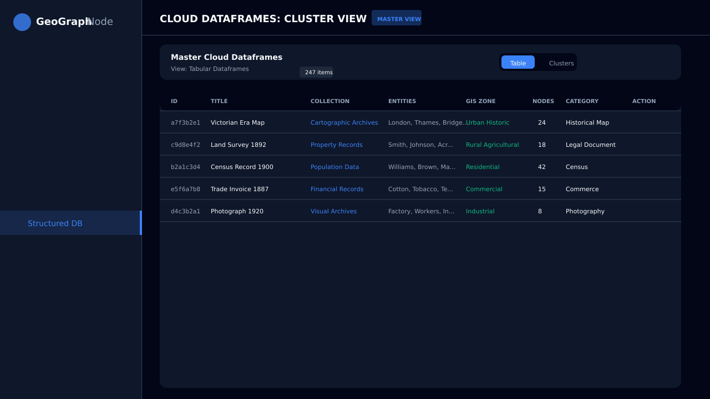
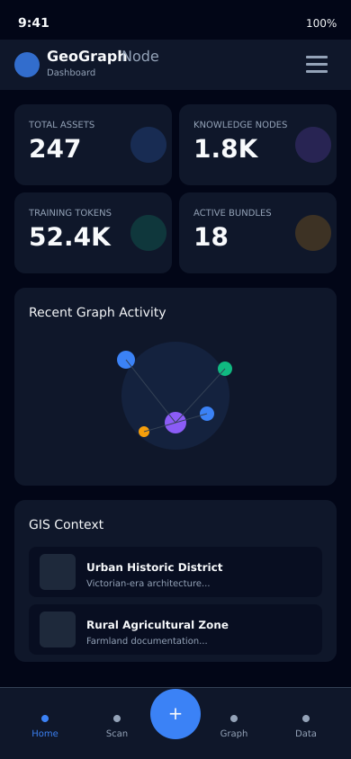

# GeoGraph Node

**Open-source code (MIT) • Public-domain contributions (CC0) • Commercial dataset licensing available**

An advanced OCR-to-Graph platform integrating GIS metadata, semantic NLP processing, and sharded NFT asset management for LLM training data.

---

## 🚀 What's New in v1.6.1
- **Advanced PWA Suite:** Full desktop-class integration with Window Controls Overlay, File Handling (drag-and-drop images/PDFs), and Share Target support.
- **System Widgets:** Added Windows 11/Android widgets for real-time OCR status monitoring directly from the OS shell.
- **Protocol Handlers:** Deep linking support via `web+geograph://` for instant graph navigation.
- **Asset Optimization:** Migrated all static assets to optimized PNGs for better cross-platform compatibility.

---

## 🖼️ Visual Tour

### Dashboard & Intelligence

*The central command center showing global stats, recent graph activity, and real-time GIS environment context.*

### Knowledge Graphs & Structured Data

  
  

*Left: Relational mapping of entities extracted by Gemini 2.5 Flash. Right: Cloud dataframes with tabular cluster view.*

### Mobile Experience

  
  

*Fully responsive mobile interface with AR scanning capabilities.*

---

## About

GeoGraph Node transforms physical documents, artifacts, and locations into structured, AI-ready training data. Using Google's Gemini 2.5 Flash for intelligent extraction, the platform creates rich knowledge graphs, preserves GIS context, and enables fractional data ownership through blockchain technology.

### Use Cases

- **Archives & Museums:** Digitize collections with high-fidelity metadata extraction.
- **Historical Research:** Build complex, connected knowledge graphs from scanned documents.
- **AI/ML Training:** Generate high-quality, ethically sourced, and licensed training datasets.
- **Field Documentation:** Capture and catalog items with real-time location and environmental context.

---

## Support
- **Issues:** GitHub Issue Tracker
- **Email:** support@geograph.foundation
- **Discord:** [Join GeoGraph Community](https://discord.gg/geograph)

Built for the global open data movement.
