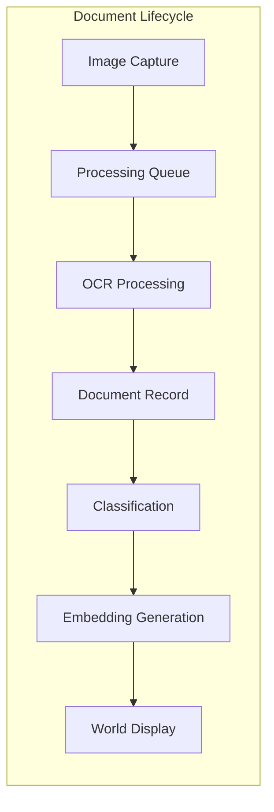
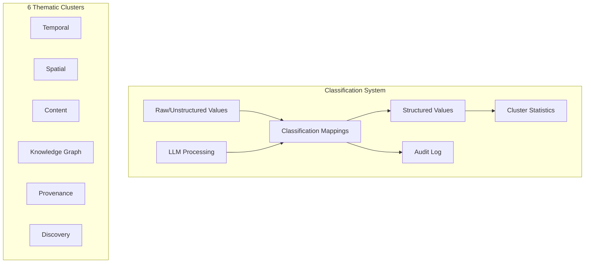
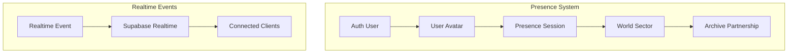
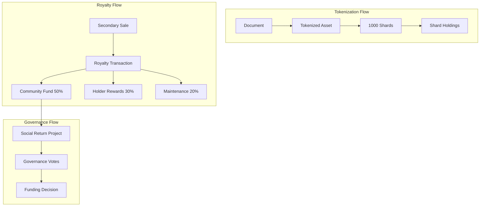
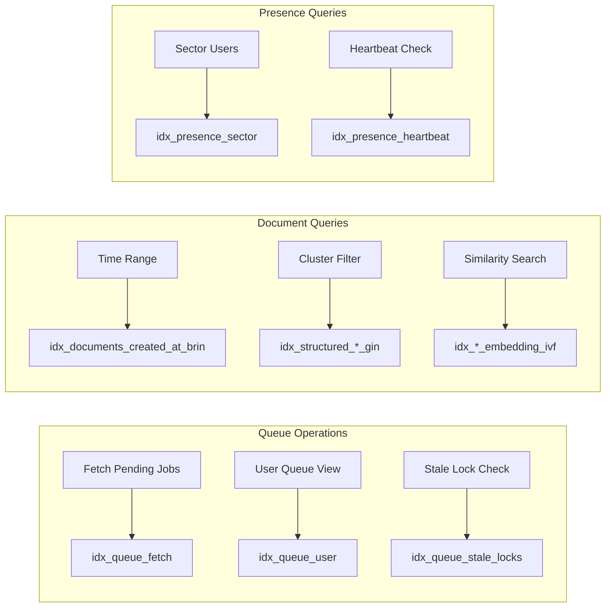

# Loadopoly-OCR Semantic Model

> **Version:** 3.0.0  
> **Last Updated:** 2026-02-04  
> **Related:** [Data Dictionary](DATA_DICTIONARY.md) | [Data Lineage](DATA_LINEAGE.md)

## Overview

This document provides a semantic model (Entity-Relationship Diagram) of the Loadopoly-OCR database schema, including domain concepts, relationships, and cardinality.

---

## Entity-Relationship Diagram

```mermaid
erDiagram
    %% ==========================================
    %% CORE ENTITIES
    %% ==========================================
    
    AUTH_USERS {
        uuid id PK
        string email
        timestamptz created_at
    }
    
    HISTORICAL_DOCUMENTS_GLOBAL {
        text ASSET_ID PK
        uuid USER_ID FK
        text DOCUMENT_TITLE
        text OCR_EXTRACTED_TEXT
        jsonb ENTITIES_EXTRACTED
        text[] KEYWORDS_TAGS
        text LOCAL_GIS_ZONE
        text NLP_NODE_CATEGORIZATION
        text PROCESSING_STATUS
        text DATA_LICENSE
        vector TEXT_EMBEDDING
        vector IMAGE_EMBEDDING
        jsonb STRUCTURED_TEMPORAL
        jsonb STRUCTURED_SPATIAL
        jsonb STRUCTURED_CONTENT
        jsonb STRUCTURED_KNOWLEDGE_GRAPH
        jsonb STRUCTURED_PROVENANCE
        jsonb STRUCTURED_DISCOVERY
        text CLASSIFICATION_LLM
        uuid BUNDLE_ID FK
        timestamptz CREATED_AT
    }
    
    PROCESSING_QUEUE {
        uuid ID PK
        uuid USER_ID FK
        text ASSET_ID
        text IMAGE_PATH
        text SCAN_TYPE
        integer PRIORITY
        text STATUS
        integer PROGRESS
        text STAGE
        integer RETRY_COUNT
        text WORKER_ID
        timestamptz LOCKED_AT
        jsonb RESULT_DATA
        timestamptz CREATED_AT
    }
    
    DIGITAL_ASSET_BUNDLES {
        uuid ID PK
        uuid USER_ID FK
        text TITLE
        text DESCRIPTION
        jsonb CONSOLIDATED_METADATA
        text[] IMAGE_URLS
        integer ASSET_COUNT
        boolean IS_AUTO_GENERATED
        timestamptz CREATED_AT
    }
    
    %% ==========================================
    %% CLASSIFICATION SYSTEM
    %% ==========================================
    
    STRUCTURED_CLUSTERS {
        uuid ID PK
        text CLUSTER_TYPE
        text DIMENSION_NAME
        text STRUCTURED_VALUE
        text VALUE_DESCRIPTION
        text[] SAMPLE_ASSET_IDS
        integer ASSET_COUNT
        timestamptz CREATED_AT
    }
    
    STRUCTURED_CLASSIFICATION_MAPPINGS {
        uuid ID PK
        text CLUSTER_TYPE
        text DIMENSION_NAME
        text RAW_VALUE
        text RAW_VALUE_NORMALIZED
        text STRUCTURED_VALUE
        text MAPPING_TYPE
        numeric CONFIDENCE
        integer OCCURRENCE_COUNT
        text CREATED_BY_LLM
        boolean IS_VALIDATED
        uuid VALIDATED_BY FK
        timestamptz CREATED_AT
    }
    
    CLASSIFICATION_AUDIT_LOG {
        uuid ID PK
        text ASSET_ID FK
        text CLUSTER_TYPE
        jsonb PREVIOUS_VALUE
        jsonb NEW_VALUE
        text CHANGE_TYPE
        text LLM_USED
        uuid CREATED_BY FK
        timestamptz CREATED_AT
    }
    
    %% ==========================================
    %% AVATAR & PRESENCE
    %% ==========================================
    
    USER_AVATARS {
        uuid ID PK
        uuid USER_ID FK "UK"
        text DISPLAY_NAME
        text AVATAR_MODEL
        text AVATAR_COLOR
        float[] LAST_POSITION
        text LAST_SECTOR
        integer CONTRIBUTION_LEVEL
        integer EXPLORATION_POINTS
        jsonb BADGES
        timestamptz LAST_SEEN
    }
    
    PRESENCE_SESSIONS {
        uuid ID PK
        uuid USER_ID FK
        text SESSION_ID UK
        text SECTOR
        float[] WORLD_POSITION
        text STATUS
        timestamptz HEARTBEAT_AT
    }
    
    WORLD_SECTORS {
        uuid ID PK
        text SECTOR_CODE UK
        text DISPLAY_NAME
        float CENTER_X
        float CENTER_Y
        float CENTER_Z
        float RADIUS
        text AESTHETIC_THEME
        text ZONE_TYPE
        integer NODE_COUNT
        timestamptz CREATED_AT
    }
    
    REALTIME_EVENTS {
        uuid ID PK
        text EVENT_TYPE
        jsonb PAYLOAD
        uuid SOURCE_USER_ID FK
        text[] AFFECTED_CHUNKS
        text PRIORITY
        boolean PROCESSED
        timestamptz CREATED_AT
    }
    
    ARCHIVE_PARTNERSHIPS {
        uuid ID PK
        text PARTNER_NAME
        text PARTNER_TYPE
        text AESTHETIC_THEME
        text DISTRICT_SECTOR_CODE FK
        integer ASSET_COUNT
        boolean IS_ACTIVE
        timestamptz SIGNED_AT
    }
    
    %% ==========================================
    %% GARD TOKENIZATION
    %% ==========================================
    
    GARD_TOKENIZED_ASSETS {
        uuid ID PK
        text ASSET_ID FK "UK"
        text NFT_TOKEN_ID UK
        integer SHARD_COUNT
        numeric SHARD_PRICE_BASE
        numeric ROYALTY_RATE
        text CONTRIBUTOR_WALLET
        numeric AI_QUALITY_SCORE
        boolean IS_GENESIS_ASSET
        timestamptz TOKENIZED_AT
    }
    
    ROYALTY_TRANSACTIONS {
        uuid ID PK
        text ASSET_ID FK
        text TOKEN_ID
        text TRANSACTION_TYPE
        numeric SALE_PRICE
        numeric ROYALTY_AMOUNT
        numeric COMMUNITY_SHARE
        numeric HOLDER_SHARE
        text TX_HASH
        bigint BLOCK_NUMBER
        timestamptz CREATED_AT
    }
    
    SHARD_HOLDINGS {
        uuid ID PK
        uuid USER_ID FK
        text ASSET_ID FK
        text TOKEN_ID
        integer SHARD_COUNT
        numeric ACQUISITION_PRICE
        numeric CURRENT_VALUE
        timestamptz ACQUISITION_DATE
    }
    
    COMMUNITY_FUND {
        uuid ID PK
        numeric BALANCE
        numeric TOTAL_DEPOSITED
        numeric TOTAL_WITHDRAWN
        timestamptz LAST_DEPOSIT_AT
    }
    
    SOCIAL_RETURN_PROJECTS {
        uuid ID PK
        text TITLE
        text DESCRIPTION
        numeric REQUESTED_AMOUNT
        numeric APPROVED_AMOUNT
        text STATUS
        integer VOTES_FOR
        integer VOTES_AGAINST
        uuid PROPOSER_ID FK
        timestamptz VOTING_DEADLINE
    }
    
    GOVERNANCE_VOTES {
        uuid ID PK
        uuid PROJECT_ID FK
        uuid VOTER_ID FK
        numeric VOTE_WEIGHT
        boolean VOTE_DIRECTION
        timestamptz VOTED_AT
    }
    
    PENDING_REWARDS {
        uuid ID PK
        uuid USER_ID FK "UK"
        numeric PENDING_AMOUNT
        numeric TOTAL_CLAIMED
        timestamptz LAST_CLAIMED_AT
    }
    
    %% ==========================================
    %% RELATIONSHIPS
    %% ==========================================
    
    %% Core Relationships
    AUTH_USERS ||--o{ HISTORICAL_DOCUMENTS_GLOBAL : "creates"
    AUTH_USERS ||--o{ PROCESSING_QUEUE : "queues"
    AUTH_USERS ||--o{ DIGITAL_ASSET_BUNDLES : "owns"
    DIGITAL_ASSET_BUNDLES ||--o{ HISTORICAL_DOCUMENTS_GLOBAL : "contains"
    PROCESSING_QUEUE ||--o| HISTORICAL_DOCUMENTS_GLOBAL : "produces"
    
    %% Classification Relationships
    AUTH_USERS ||--o{ STRUCTURED_CLASSIFICATION_MAPPINGS : "validates"
    AUTH_USERS ||--o{ CLASSIFICATION_AUDIT_LOG : "triggers"
    HISTORICAL_DOCUMENTS_GLOBAL ||--o{ CLASSIFICATION_AUDIT_LOG : "audits"
    
    %% Avatar & Presence Relationships
    AUTH_USERS ||--|| USER_AVATARS : "has"
    AUTH_USERS ||--o{ PRESENCE_SESSIONS : "maintains"
    AUTH_USERS ||--o{ REALTIME_EVENTS : "generates"
    WORLD_SECTORS ||--o{ ARCHIVE_PARTNERSHIPS : "hosts"
    
    %% GARD Relationships
    HISTORICAL_DOCUMENTS_GLOBAL ||--o| GARD_TOKENIZED_ASSETS : "tokenizes"
    AUTH_USERS ||--o{ SHARD_HOLDINGS : "holds"
    AUTH_USERS ||--o{ SOCIAL_RETURN_PROJECTS : "proposes"
    AUTH_USERS ||--o{ GOVERNANCE_VOTES : "casts"
    AUTH_USERS ||--|| PENDING_REWARDS : "earns"
    SOCIAL_RETURN_PROJECTS ||--o{ GOVERNANCE_VOTES : "receives"
    GARD_TOKENIZED_ASSETS ||--o{ ROYALTY_TRANSACTIONS : "generates"
    GARD_TOKENIZED_ASSETS ||--o{ SHARD_HOLDINGS : "fractionalized_into"
```



---

## Domain Concepts

### 1. Document Domain

The core domain represents digitized historical documents and their metadata.



**Key Entities:**
- **Processing Queue**: Manages async OCR job processing
- **Historical Documents Global**: Core document storage with all extracted metadata
- **Digital Asset Bundles**: Groups of similar/duplicate documents

---

### 2. Classification Domain

The classification domain enables LLM-synchronized structured values across 6 thematic clusters.



**Cluster Dimensions:**

| Cluster | Example Dimensions |
|---------|-------------------|
| TEMPORAL | era, historicalPeriod, documentAge |
| SPATIAL | zone, geographicScale, placeType |
| CONTENT | category, scanType, mediaType, subjectMatter |
| KNOWLEDGE_GRAPH | nodeType, connectionDensity, narrativeRole |
| PROVENANCE | license, verificationLevel, confidence |
| DISCOVERY | source, status, serendipityScore |

---

### 3. Avatar & Presence Domain

The presence domain enables real-time multi-user interaction in the 3D world.



**Key Concepts:**
- **User Avatar**: Persistent identity with progression
- **Presence Session**: Ephemeral real-time location
- **World Sector**: Procedurally generated zones from document clusters
- **Archive Partnership**: Institutional partners with themed districts

---

### 4. GARD Tokenization Domain

The GARD (SocialReturnSystem) domain enables asset tokenization and community governance.



**Economic Model:**
- **Fractionalization**: Each asset minted as 1000 ERC-1155 shards
- **Royalties**: 10% on secondary sales, distributed to stakeholders
- **DAO Governance**: Shard-weighted voting on community fund allocation

---

## Relationship Cardinality

| From | Relationship | To | Cardinality |
|------|--------------|-----|-------------|
| AUTH_USERS | creates | HISTORICAL_DOCUMENTS_GLOBAL | 1:N |
| AUTH_USERS | queues | PROCESSING_QUEUE | 1:N |
| AUTH_USERS | owns | DIGITAL_ASSET_BUNDLES | 1:N |
| AUTH_USERS | has | USER_AVATARS | 1:1 |
| AUTH_USERS | maintains | PRESENCE_SESSIONS | 1:N |
| AUTH_USERS | holds | SHARD_HOLDINGS | 1:N |
| AUTH_USERS | earns | PENDING_REWARDS | 1:1 |
| DIGITAL_ASSET_BUNDLES | contains | HISTORICAL_DOCUMENTS_GLOBAL | 1:N |
| PROCESSING_QUEUE | produces | HISTORICAL_DOCUMENTS_GLOBAL | 1:0..1 |
| HISTORICAL_DOCUMENTS_GLOBAL | tokenizes | GARD_TOKENIZED_ASSETS | 1:0..1 |
| GARD_TOKENIZED_ASSETS | generates | ROYALTY_TRANSACTIONS | 1:N |
| GARD_TOKENIZED_ASSETS | fractionalized_into | SHARD_HOLDINGS | 1:N |
| SOCIAL_RETURN_PROJECTS | receives | GOVERNANCE_VOTES | 1:N |
| WORLD_SECTORS | hosts | ARCHIVE_PARTNERSHIPS | 1:N |

---

## Indexes & Performance

### Primary Lookup Patterns



### Index Types Used

| Index Type | Use Case | Tables |
|------------|----------|--------|
| **B-tree** | Primary keys, foreign keys | All tables |
| **BRIN** | Time-series data (10x smaller) | historical_documents_global, royalty_transactions |
| **GIN** | JSONB search, array containment | STRUCTURED_* columns, ENTITIES_EXTRACTED |
| **IVFFlat** | Vector similarity (pgvector) | TEXT_EMBEDDING, IMAGE_EMBEDDING |
| **Partial** | Filtered subsets | Queue status filters |

---

## Schema Evolution

### Migration Path

```
v2.8.0 (2025-11)
├── Added processing_queue
├── Added GARD tokenization tables
└── Basic RLS policies

v2.8.1 (2025-12)
├── Added structured_clusters
├── Added STRUCTURED_* columns
├── Added vector embeddings
└── Added GIN/BRIN indexes

v3.0.0 (2026-02) ← CURRENT
├── Consolidated schema
├── Unified column naming (UPPERCASE)
├── Fixed all Supabase linter issues
├── Added comprehensive documentation
└── Optimized RLS policies with (select auth.uid())
```

---

## Security Model

### Row Level Security Summary

| Table | SELECT | INSERT | UPDATE | DELETE |
|-------|--------|--------|--------|--------|
| processing_queue | Owner + service_role | Owner | Owner + service_role | - |
| historical_documents_global | Owner or NULL USER_ID | Owner or NULL | Owner only | Owner only |
| digital_asset_bundles | Public | Owner | Owner | Owner |
| structured_clusters | Public | Authenticated | Authenticated | - |
| user_avatars | Public | Owner | Owner | - |
| presence_sessions | Public | Owner | Owner | Owner |
| royalty_transactions | Public | service_role only | - | - |
| shard_holdings | Owner + service_role | service_role | service_role | - |
| governance_votes | Public | Voter only | - | - |

---

## Appendix: SQL DDL Reference

For the complete SQL schema, see:
- [CONSOLIDATED_SCHEMA.sql](../sql/CONSOLIDATED_SCHEMA.sql) - Single source of truth
- [HEALTH_CHECK_V2.8.1.sql](../sql/HEALTH_CHECK_V2.8.1.sql) - Schema verification
