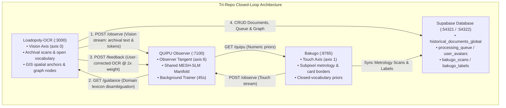

# System Dynamics — Loadopoly-OCR (Vision Axis & Archival Knowledge Ingestion)

Version: 2.22.1  
Date: 2026-08-20  

---

## 1. System Role in the Tri-Repo Mesh

In the unified multi-repo architecture, **Loadopoly-OCR** operates as the **Vision Sense Axis** ($\text{axis}=0$), driving the continuous exploratory acquisition of unstructured historical text, archival document images, GIS spatial coordinates, and knowledge graph nodes. It interfaces directly with **QUIPU** (the 7th-dimensional Observer learning hub) and **Supabase** (the relational PostgreSQL data backbone).



### Contrast of Sense Complementarity

| Dimension | Vision Sense Axis (`Loadopoly-OCR`) | Touch Sense Axis (`Bakugo`) |
| :--- | :--- | :--- |
| **Input Modality** | Unstructured archival records, deeds, maps, books | Rigid rectangular collectible cards & slabs |
| **Vocabulary Space**| Open-vocabulary, multi-lingual historical terminology | Closed-vocabulary catalog IDs & collector numbers |
| **Coordinate Space**| GPS Latitude/Longitude, GIS zones, pixel bboxes | Millimeter-calibrated physical borders & ratios |
| **Manifold Impact** | Drives token acquisition & vocabulary expansion | Enforces geometric consistency & ratio bounds |

---

## 2. Ingestion & Guidance Control Dynamics

### 2.1. Vision Observation Feed (`POST /observe`)
Upon completing OCR extraction, `src/services/quipuService.ts` asynchronously posts the normalized transcription to QUIPU's vision axis (`loadopoly-ocr/commoncrawl/hideout-mesh`):
```json
{
  "source": "loadopoly-ocr",
  "kind": "unstructured",
  "text": "Historical land deed surveyed 1887 parcel 025 lot 9 57.2 acres",
  "confidence": 0.88,
  "meta": { "asset_id": "ASSET-1887-025", "gis_zone": "ZONE-4" }
}
```
This expands the global vocabulary $\mathcal{V}_{mesh}$ and strengthens quipu bigram transitions.

### 2.2. Domain Lexicon Guidance Ingestion (`GET /guidance`)
To minimize hallucinations on damaged, low-contrast, or archaic glyphs, Loadopoly-OCR pulls domain lexicon priors from the Observer via `lexiconHint()` and injects them into the extraction prompt:
```typescript
export const lexiconHint = (maxTokens = 40): string => {
  const g = getGuidance();
  if (!g?.lexicon?.length) return '';
  const terms = g.lexicon.slice(0, maxTokens).map((e) => e.token).join(', ');
  return `
    **DOMAIN LEXICON (QUIPU Observer):**
    Terms observed across this corpus and its sibling structured-image corpus:
    ${terms}.
    Use these ONLY as disambiguation priors when glyphs are unclear or ambiguous.
    Never invent text from this list; transcribe what is actually in the image.
  `;
};
```

### 2.3. Ground-Truth Reinforcement (`POST /feedback`)
When users correct OCR transcriptions in the UI, Loadopoly-OCR reports both the expected text and the initial misreading to `POST /feedback`. The Observer folds the expected text in with double ($2\times$) weight, adjusting bigram probabilities so future extractions favor verified readings.

---

## 3. Database Persistence & Relational Architecture

### 3.1. Consolidated Supabase Schema
The complete system schema resides in `sql/CONSOLIDATED_SCHEMA.sql` and is mirrored via PostgREST:
- `historical_documents_global`: Core document repository with uppercase columns (`ASSET_ID`, `DOCUMENT_TITLE`, `RAW_OCR_TRANSCRIPTION`, `LATITUDE`, `LONGITUDE`, `GARD_TOKEN_ID`).
- `processing_queue`: Job queue for asynchronous background OCR tasks with state machine transitions (`PENDING` $\to$ `PROCESSING` $\to$ `COMPLETED` / `FAILED`).
- `user_avatars`, `presence_sessions`, `world_sectors`: Real-time user presence and geospatial sector tracking.
- `spatial_anchors`, `graph_nodes`, `graph_edges`, `asset_graph_nodes`: Knowledge graph and spatial relationship topology.
- `bakugo_scans`, `bakugo_labels`: Mirrored metrology data from the Touch axis.

### 3.2. Row Level Security (RLS) & Access Controls
- **Public / Anon**: Allowed to read public catalogs, query avatars, and submit scans.
- **Authenticated**: Allowed to insert and manage user-owned documents, queue jobs, and spatial anchors.
- **Service Role**: Exclusive authority to execute hard deletes and background queue scheduling.

---

## 4. Observability & Telemetry Verification

```bash
# 1. Verify Loadopoly-OCR Vite dev server
curl -s -I http://127.0.0.1:3000

# 2. Check QUIPU Observer guidance endpoint from client perspective
curl -s "http://127.0.0.1:7100/guidance?source=loadopoly-ocr" | jq '{ok: .ok, vocab_count: .mesh.vocab, top_lexicon: .lexicon[0:5]}'

# 3. Query documents and avatars from Supabase PostgREST
curl -s -H "apikey: $VITE_SUPABASE_ANON_KEY" \
     -H "Authorization: Bearer $VITE_SUPABASE_ANON_KEY" \
     "http://127.0.0.1:54321/rest/v1/user_avatars?select=*" | jq .
```
